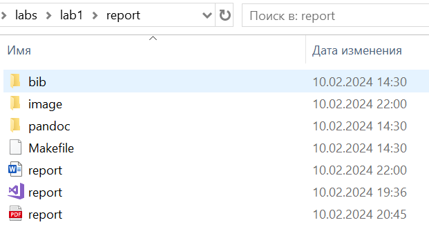

---
## Front matter
title: "Отчёт по лабораторной работе №1

Математическое моделирование"
subtitle: "Настройка рабочего пространства. Система контроля версий Git. Язык разметки Markdown"
author: "Выполнил: Прасолов Валерий Сергеевич, 

НПИбд-02-21, 1032212968"

## Generic otions
lang: ru-RU
toc-title: "Содержание"

## Bibliography
bibliography: bib/cite.bib
csl: pandoc/csl/gost-r-7-0-5-2008-numeric.csl

## Pdf output format
toc: true # Table of contents
toc-depth: 2
lof: true # List of figures
fontsize: 12pt
linestretch: 1.5
papersize: a4
documentclass: scrreprt
## I18n polyglossia
polyglossia-lang:
  name: russian
  options:
	- spelling=modern
	- babelshorthands=true
polyglossia-otherlangs:
  name: english

## I18n babel
babel-lang: russian
babel-otherlangs: english
mainfont: Arial 
monofont: Courier New 
fontsize: 12pt

## Fonts
mainfont: PT Serif
romanfont: PT Serif
sansfont: PT Sans
monofont: PT Mono
mainfontoptions: Ligatures=TeX
romanfontoptions: Ligatures=TeX
sansfontoptions: Ligatures=TeX,Scale=MatchLowercase
monofontoptions: Scale=MatchLowercase,Scale=0.9
## Biblatex
biblatex: true
biblio-style: "gost-numeric"
biblatexoptions:
  - parentracker=true
  - backend=biber
  - hyperref=auto
  - language=auto
  - autolang=other*
  - citestyle=gost-numeric
## Pandoc-crossref LaTeX customization
figureTitle: "Рис."
tableTitle: "Таблица"
listingTitle: "Листинг"
lofTitle: "Список иллюстраций"
lolTitle: "Листинги"
## Misc options
indent: true
header-includes:
  - \usepackage{indentfirst}
  - \usepackage{float} # keep figures where there are in the text
  - \floatplacement{figure}{H} # keep figures where there are in the text
---

# Цель работы

Настроить рабочее пространство для лабораторной работы. Изучить систему контроля версий Git и язык разметки Markdown.

# Задание

Создать директорию, создать репозиторий. При помощи Makefile сконвертировать из файла .md файлы отчетов в форматах docx и pdf.

# Теоретическое введение

Git — система управления версиями с распределенной архитектурой. В отличие от некогда популярных систем вроде CVS и Subversion (SVN), где полная история версий проекта доступна лишь в одном месте, в Git каждая рабочая копия кода сама по себе является репозиторием. Это позволяет всем разработчикам хранить историю изменений в полном объеме.

Markdown — облегчённый язык разметки, созданный с целью обозначения форматирования в простом тексте, с максимальным сохранением его читаемости человеком, и пригодный для машинного преобразования в языки для продвинутых публикаций (HTML, Rich Text и других). 

| Название команды | Описание команды                                                                                                         |
|--------------|----------------------------------------------------------------------------------------------------------------------------|
| `git clone`          | Клонирование репозитория на ПК                                                                              |
| `git commit -m "Initial Commit"`      | Оставление коммита    |
| `git push`       | Загрузка изменений на гит                       |
| `make`      | Конвертация файла .md |

 

# Выполнение лабораторной работы

**1.** Создадим директорию на своем компьютере по шаблону:

**2.** Зайдем в PowerShell под администратором:

**3.** Устанавливаем Pundoc:

**4.** Устанавливаем msys2:

**5.** Сознание репозитория курса на основе шаблона:

**6.** Настройка каталога курса:
**6.1** Заходим в msys2:

**6.2** Переходим в каталог курса и создаём необходимые каталоги:

**7.** Репозиторий склонирован:

**8.**Создадим папку Labs с внутренней папкой Lab01. Внутри папки Lab01 папки report и presentation.

**9.** Конвертируем .md файл в docx командой:

**10.** Получили docx файл:

**11.** Для конвертации .md файла в pdf потребуется установка TeX Live.Установим MiKTeX как альтернативу TeX Live для LaTeX:

**12.** Конвертируем .md файл в pdf командой:

`pandoc report.md -o report.pdf --pdf-engine=lualatex -V mainfont="Times New Roman" -V sansfont="DejaVu Sans" -V monofont="DejaVu Sans Mono"` 

**13.** Получили pdf файл:

**14.** Итоговый вид папки отчета лабораторной работы:

**15.** Конвертируем .md файл презентации в pdf презентации командой:

**16.** Получили pdf файл презентации:

# Вывод

Мы настроили рабочее пространство для лабораторной работы. Изучили систему контроля версий Git и язык разметки Markdown.

# Список литературы. Библиография

- Документация по Git: https://git-scm.com/book/ru/v2

- Документация по Markdown: https://learn.microsoft.com/ru-ru/contribute/markdown-reference

- Документация по MiKTeX: https://kpfu.ru/staff_files/F2077692752/Inst_MiKTeX.pdf